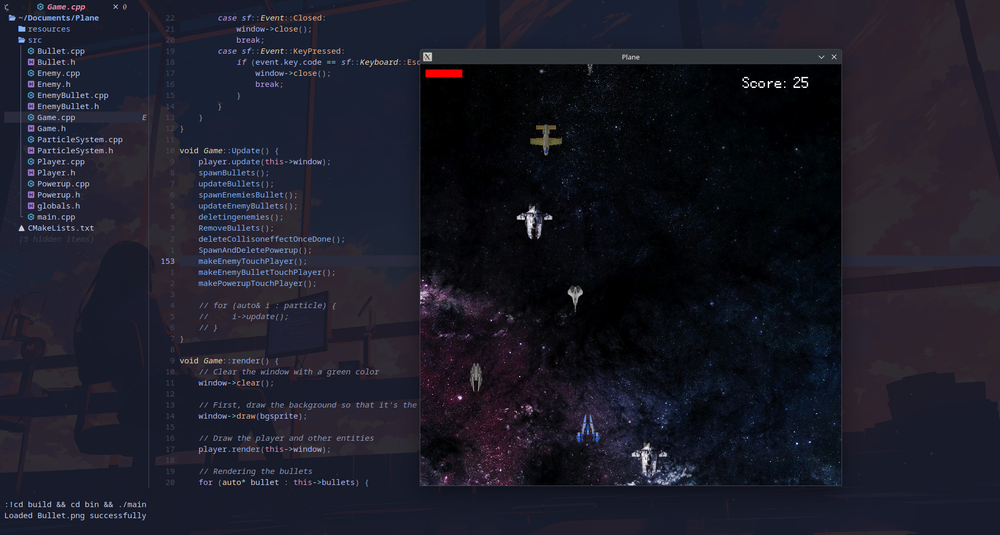

# **Setup and Run Instructions**

## **Clone the Repository**
```sh
git clone https://github.com/Bishmit/Plane.git
cd Plane
```
*Linux (Debian/Ubuntu-based)*
```
sudo apt update
sudo apt install libsfml-dev ninja-build cmake g++
mkdir build && cd build
cmake .. -G Ninja   # Use "cmake .." you prefer Make
ninja               # If using Make, run: make
./bin/Plane

```
*Linux(Arch based)*
```
sudo pacman -Syu sfml ninja cmake gcc
mkdir build && cd build
cmake .. -G Ninja
ninja
./bin/Plane
```

*Linux(fedora)*
```
sudo dnf install SFML-devel ninja-build cmake g++
mkdir build && cd build
cmake .. -G Ninja
ninja
./bin/Plane
```

*MacOs*
```
brew install sfml ninja cmake
mkdir build && cd build
cmake .. -G Ninja
ninja
./bin/Plane
```

If SFML isn't detected, set the environment variable:
```
export SFML_DIR=$(brew --prefix sfml)
```
*Windows*

Using Visual Studio (Recommended)
```
mkdir build && cd build
cmake .. -G "Visual Studio 17 2022"
Open the generated .sln file in Visual Studio, set the project as the startup project, then build and run it.
```
Using VS Code / Neovim / Other Editors
```
--- Make sure  SFML is correctly installed and configured ---
mkdir build && cd build
cmake .. -G Ninja
ninja
./bin/Plane
```

Notes

    - If using Windows, you may need to configure the SFML library path manually.
    - If using macOS, ensure SFML is correctly linked via Homebrew.


**Game looks like this right now:** 

 


